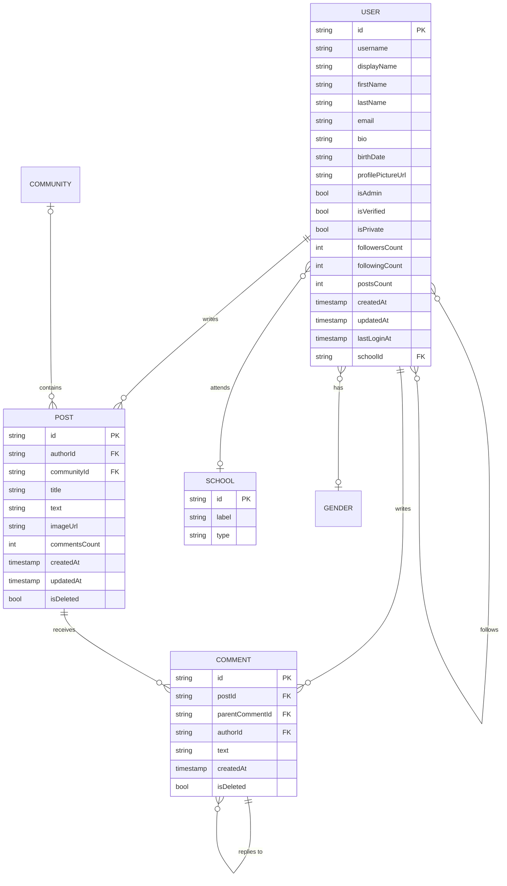

# Logical Data Model – Same API

## 1. Schema

```mermaid
erDiagram
    USER ||--o{ POST : "writes"
    USER ||--o{ COMMENT : "writes"
    USER }o--o{ USER : "follows"
    USER }o--o| SCHOOL : "attends"
    USER }o--o| GENDER : "has"
    POST ||--o{ COMMENT : "receives"
    COMMENT ||--o{ COMMENT : "replies to"
    COMMUNITY |o--o{ POST : "contains"

    USER {
        string id PK
        string username
        string displayName
        string firstName
        string lastName
        string email
        string bio
        string birthDate
        string profilePictureUrl
        bool isAdmin
        bool isVerified
        bool isPrivate
        int followersCount
        int followingCount
        int postsCount
        timestamp createdAt
        timestamp updatedAt
        timestamp lastLoginAt
        string schoolId FK
    }
    POST {
        string id PK
        string authorId FK
        string communityId FK
        string title
        string text
        string imageUrl
        int commentsCount
        timestamp createdAt
        timestamp updatedAt
        bool isDeleted
    }
    COMMENT {
        string id PK
        string postId FK
        string parentCommentId FK
        string authorId FK
        string text
        timestamp createdAt
        bool isDeleted
    }
    SCHOOL {
        string id PK
        string label
        string type
    }
```

---