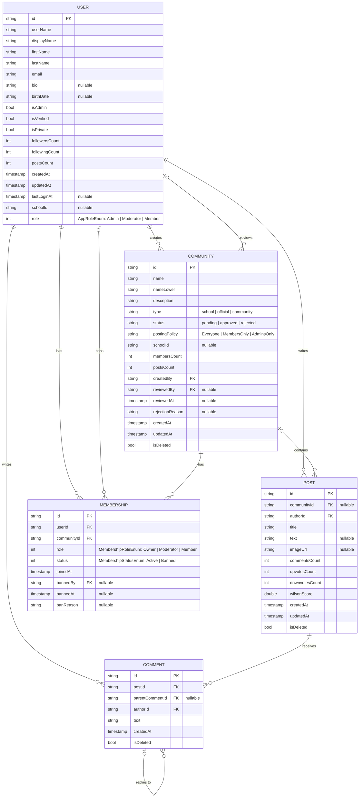

# Logical Data Model – Same API (v2, généré depuis les DAO)

```mermaid
erDiagram
    USER ||--o{ POST : "writes"
    USER ||--o{ COMMENT : "writes"
    USER ||--o{ MEMBERSHIP : "has"
    USER ||--o{ COMMUNITY : "creates"
    USER |o--o{ COMMUNITY : "reviews"
    USER |o--o{ MEMBERSHIP : "bans"
    COMMUNITY ||--o{ MEMBERSHIP : "has"
    COMMUNITY |o--o{ POST : "contains"
    POST ||--o{ COMMENT : "receives"
    COMMENT |o--o{ COMMENT : "replies to"

    USER {
        string id PK
        string userName
        string displayName
        string firstName
        string lastName
        string email
        string bio "nullable"
        string birthDate "nullable"
        bool isAdmin
        bool isVerified
        bool isPrivate
        int followersCount
        int followingCount
        int postsCount
        timestamp createdAt
        timestamp updatedAt
        timestamp lastLoginAt "nullable"
        string schoolId "nullable"
        int role "AppRoleEnum: Admin | Moderator | Member"
    }
    COMMUNITY {
        string id PK
        string name
        string nameLower
        string description
        string type "school | official | community"
        string status "pending | approved | rejected"
        string postingPolicy "Everyone | MembersOnly | AdminsOnly"
        string schoolId "nullable"
        int membersCount
        int postsCount
        string createdBy FK
        string reviewedBy FK "nullable"
        timestamp reviewedAt "nullable"
        string rejectionReason "nullable"
        timestamp createdAt
        timestamp updatedAt
        bool isDeleted
    }
    MEMBERSHIP {
        string id PK
        string userId FK
        string communityId FK
        int role "MembershipRoleEnum: Owner | Moderator | Member"
        int status "MembershipStatusEnum: Active | Banned"
        timestamp joinedAt
        string bannedBy FK "nullable"
        timestamp bannedAt "nullable"
        string banReason "nullable"
    }
    POST {
        string id PK
        string communityId FK "nullable"
        string authorId FK
        string title
        string text "nullable"
        string imageUrl "nullable"
        int commentsCount
        int upvotesCount
        int downvotesCount
        double wilsonScore
        timestamp createdAt
        timestamp updatedAt
        bool isDeleted
    }
    COMMENT {
        string id PK
        string postId FK
        string parentCommentId FK "nullable"
        string authorId FK
        string text
        timestamp createdAt
        bool isDeleted
    }
```
